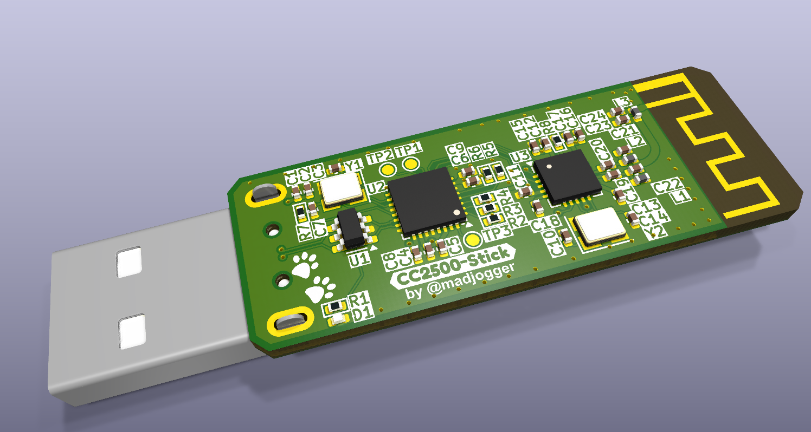

# CC2500-RF-USB-Stick  

> USB RF transceiver stick based on **CC2500RGPR** and **FT4222H** (USB↔SPI bridge).  
> Implemented as a **USB flash-drive style dongle** with on-board PCB antenna.  

---

## What’s on the board  
- **FT4222H USB-SPI bridge**  
  - Provides standard SPI master interface over USB  
  - Enumerates as USB device (driver support in Windows/Linux)  
- **CC2500RGPR RF transceiver**  
  - Sub-1 GHz / 2.4 GHz ISM band  
  - Connected directly to FT4222H SPI  
  - Standard configuration mode supported  
- **PCB antenna** integrated into board  
- **USB 2.0 Type-A plug** (flash-stick style)  
- Power from USB bus only (no external supply)  

---

## Pinout (FT4222H ↔ CC2500)  

| FT4222H Pin | CC2500 Pin | Notes |
|-------------|------------|-------|
| SCLK | SCLK | SPI clock |
| MOSI | SI   | SPI data out |
| MISO | SO   | SPI data in |
| CS0  | CSn  | Chip select |
| X | GDO0/GDO2 | Interrupt / status lines |

---

## Power & Form Factor  
- Powered directly from **USB Type-A**  
- Compact PCB with integrated RF antenna  
- No extra components required to operate  

---

## Use Case  
- RF packet capture and transmission via **CC2500**  
- USB plug-and-play stick for wireless experiments  
- Can be used in custom RF tools, sniffers, IoT gateways  

---

## Quick Use  
1. Plug **CC2500-RF-USB-Stick** into USB port.  
2. Install FT4222H driver (if required).  
3. Use SPI commands over FT4222H to configure and control CC2500.  
4. Transmit/receive RF packets in 2.4 GHz band.  

---

## Notes  
- PCB antenna may require tuning for optimal performance.  
- CC2500 settings (frequency, modulation, packet format) configurable via SPI.  
- Heat dissipation negligible (low-power device).  

---
